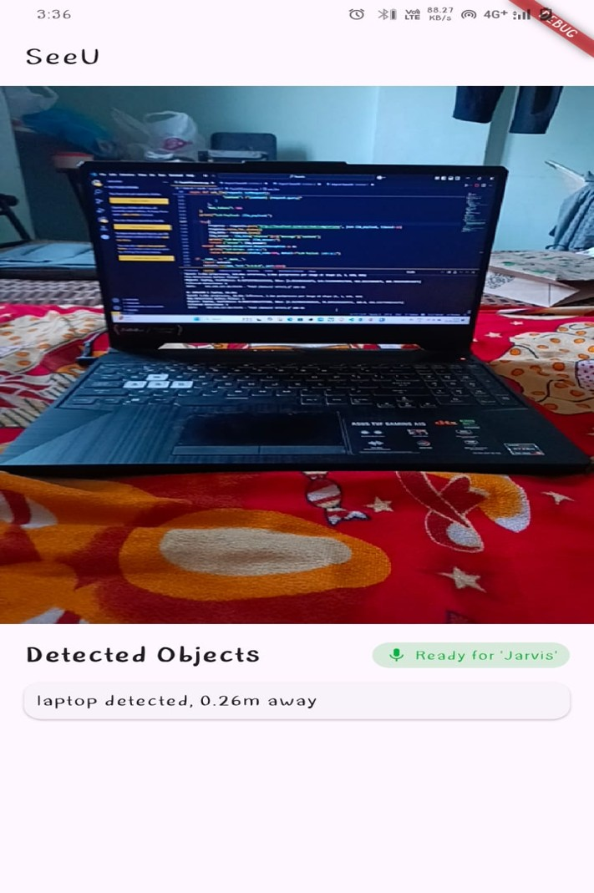
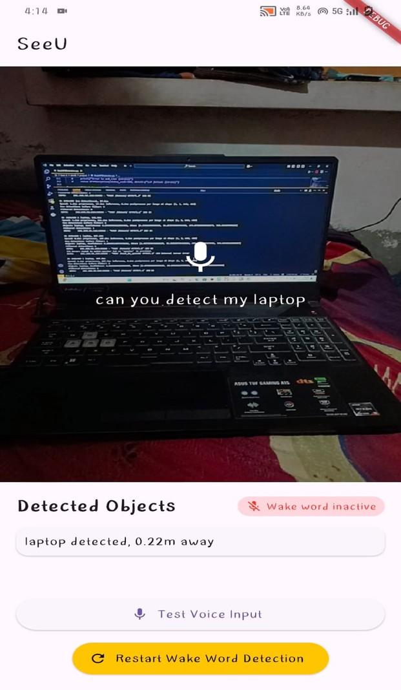

# 👁️‍🗨️ SeeU: Real-Time Object Detection and Distance Estimation App

**SeeU** is a mobile + AI-powered assistive application developed to help visually impaired individuals navigate safely using real-time object detection, distance estimation, and audio feedback.

---

## 📱 Features

- 🔍 Real-time object detection using YOLOv8
- 📏 Distance estimation using MiDaS depth model
- 🗣️ Audio feedback with Text-to-Speech (Coqui XTTS v2)
- 🎙️ Wake-word activation ("Jarvis") with Porcupine
- 🧠 Query answering using LLaVA multimodal LLM
- 🌐 FastAPI backend for image processing and inference

---

## 🧠 Tech Stack

| Component      | Technology                       |
|----------------|-----------------------------------|
| Frontend       | Flutter (Dart)                   |
| Backend        | FastAPI (Python)                 |
| Object Detection | YOLOv8                          |
| Depth Estimation | MiDaS                           |
| Text-to-Speech | Coqui XTTS v2                    |
| Wake Word      | Porcupine                        |
| LLM            | LLaVA v1.5 7B                    |

---

## 🧩 Modules

- **User Interface (Flutter)**
- **YOLOv8 Object Detection**
- **MiDaS Depth Estimation**
- **Text-to-Speech via Coqui XTTS**
- **Wake Word Detection (Porcupine)**
- **Multimodal Query Handling (LLaVA)**

---

## 🖥️ Backend Endpoints

| Endpoint          | Description                         |
|-------------------|-------------------------------------|
| `/detect/`        | Object detection + distance estimation |
| `/ask_llm/`       | LLM query processing with context     |
| `/text_to_speech/`| Converts response text to audio       |

---

## 📷 Screenshots
### 🎯 Real-Time Detection


### 🎙️ Voice Command with Wake Word


## 🚀 How to Run

### Backend (Python - FastAPI)
```bash
pip install -r requirements.txt
uvicorn app:app --host 0.0.0.0 --port 8000
